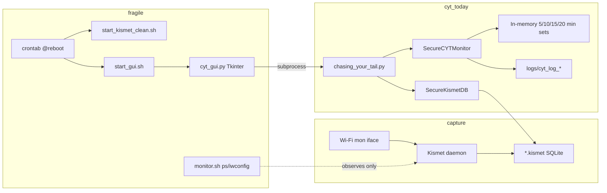
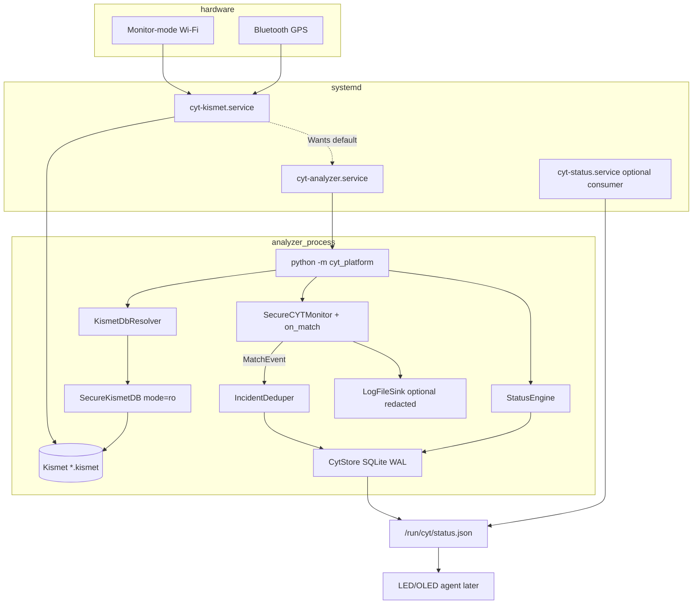
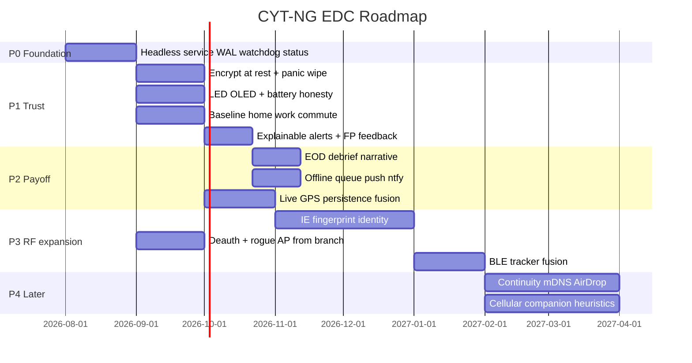

# CYT-NG EDC Platform: Headless Crash-Safe Service Foundation (PR1)

| Field | Value |
|-------|--------|
| **Document** | CYT-NG World-Class EDC Personal SIGINT Platform — Design |
| **Author** | _(TBD)_ |
| **Date** | 2026-08-05 |
| **Status** | Approved (Rev 2.1) — P0 foundation implemented on `feat/edc-platform-foundation` |
| **Scope** | PR1 foundation (systemd + WAL store + watchdog + status); feature evaluation; phased roadmap |
| **Codebase** | `/home/ubuntu/Chasing-Your-Tail-NG` (main @ `89c88be`; CM5 branch `origin/claude/optimize-raspberry-pi-cm5-vcwVM`) |
| **Target hardware** | Raspberry Pi Compute Module 5 (CM5), Wi-Fi monitor-mode adapter, Bluetooth GPS |

---

## Overview

Chasing-Your-Tail-NG (CYT) is a passive Wi-Fi probe-request analyzer that reads Kismet’s SQLite capture databases and detects device reappearance across sliding time windows. Today it is a **demo-oriented tool**: a long-lived Python process (`chasing_your_tail.py`) with in-memory tracking only, file-log side effects, a Tkinter GUI (`cyt_gui.py`) as the primary control surface, and fragile boot via shell scripts + crontab. There is **no durable CYT state store**, **no self-supervision**, **no heartbeat for glanceable health**, and **no graceful handling of Kismet DB rollover** after the initial `glob` of `latest_file`.

This design converts CYT into a **headless, crash-safe, watchdog-supervised service platform** suitable for body-worn EDC on a CM5. The non-negotiable product thesis: a world-class EDC tool optimizes for **trust, glanceability, and zero-friction unattended operation**—not peak demo capability. PR1 delivers the foundation those later features (encryption-at-rest, baseline learning, debrief, phone push, RF expansions) all depend on.

**Proposed solution (PR1):** systemd units for Kismet + CYT analyzer (optional status agent), an owned SQLite store with WAL and schemas for events/entities/heartbeats/runtime state, an **incident-based event dedup policy**, a deterministic status engine with **hold/hysteresis** (`clear` / `watch` / `alert` / `fail`), Kismet DB re-discovery on rollover, **deaf-capture detection**, a **PR1 privacy floor**, and a single **`on_match` adapter** that keeps `SecureCYTMonitor` detection logic intact while routing matches into durable incidents.

**PR1 durability scope (honest):** durable **events, incidents, status, heartbeats, ops continuity**. Sliding time-window sets remain **in-memory** and rehydrate from Kismet when possible; PR1 does **not** claim continuous detection memory across power loss when the Kismet DB is new/empty.

---

## Background & Motivation

### Current architecture (verified in tree)



| Component | Path | Role today | EDC gap |
|-----------|------|------------|---------|
| Main loop | `chasing_your_tail.py` | Glob newest `.kismet` once (`getctime`); open/close each cycle; `SecureCYTMonitor` + sleep | No persistent store; fixed `latest_file`; errors `continue` without fail-state; log file is only durable output |
| Detection | `secure_main_logic.SecureCYTMonitor` | In-memory MAC/SSID sets; rotate every N cycles; print + `log_file.write` | State lost on crash/restart; no structured events; detection OK to keep. Note: MAC set membership uses raw `mac` vs uppercased sets (latent case bug) |
| Kismet I/O | `secure_database.SecureKismetDB` | Parameterized queries on `devices`; default RW open (reads only in practice) | Good SQL safety; no `mode=ro`; path never refreshes after startup |
| Time windows | `secure_database.SecureTimeWindows` | 5/10/15/20 min boundaries from config | Fine; keep |
| Ignore lists | `secure_ignore_loader.load_ignore_lists` | Loads from `./ignore_lists/` + config filenames; supports JSON **and** Python-list text | Path hardcoded to CWD `./ignore_lists`. Repo has `mac_list.json` / `ssid_list.json` but committed `config.json` still names `mac_list.py` / `ssid_list.py` (stale) |
| Credentials | `secure_credentials.SecureCredentialManager` | Fernet + PBKDF2 for API keys; `CYT_MASTER_PASSWORD` env | Credential encrypt only—not data-at-rest for logs/DB. Analyzer does not need WiGLE at runtime |
| Surveillance (batch) | `surveillance_detector.py`, `surveillance_analyzer.py`, `gps_tracker.py` | Post-hoc persistence scoring + KML | Not in live loop; in-memory only during analysis run |
| GUI | `cyt_gui.py` | Status via `pgrep`/`iwconfig`; starts CYT via `subprocess.Popen` | Not EDC-suitable as primary UX; requires DISPLAY |
| Boot | `start_kismet_clean.sh`, `start_gui.sh` | Hardcoded `/home/matt/Desktop/cytng`; sleep 120 for X; `sudo ... kismet --daemonize` | Fragile, non-portable, no restart policy |
| “Watchdog” | `monitor.sh` | Colored echo of process count + monitor mode | Not supervision; no restart; no heartbeat |
| Config | `config.json` | Paths, timing, geo search box | Hardcoded `/home/matt/kismet_logs/*.kismet`; no service/status/store sections |
| CM5 branch extras | `deauth_detector.py`, `rogue_ap_detector.py` on `origin/claude/optimize-raspberry-pi-cm5-vcwVM` | Capability modules before platform | Valuable later; must not block foundation |

### Pain points for body-worn EDC

1. **Power loss mid-run loses all tracking state** — `SecureCYTMonitor` holds four MAC sets and four SSID sets only in RAM. After reboot with a new/empty Kismet file, the operator has a cold ~20-minute detection-blind period. PR1 will **persist events/status**, not window sets (see cold-start honesty below).
2. **Boot is not a service** — Kismet via root crontab + `start_kismet_clean.sh`; GUI waits up to 300s for X. No `Restart=`, no dependency ordering, no resource limits.
3. **No trustworthy “am I protecting you?” signal** — GUI polls `pgrep kismet` and DB mtime; process-up ≠ RF-alive. Stale analyzer still looks “up.”
4. **Kismet DB rollover** — `latest_file` chosen once at startup. After rotation, CYT reads a cold file until restart.
5. **Dual write surface is logs only** — free-text `cyt_log_*`; no schema for entities, scores, or heartbeats.
6. **Tkinter as control plane** — fine for lab; wrong for pocket CM5.

### Why PR1 before crypto / baselines / RF

Encryption-at-rest, panic wipe, baseline learning, debrief, and multi-modal identity all need a **durable event stream** and a **process that stays up**. Building those on today’s process model multiplies failure modes. Foundation first — with a **privacy floor** from day one because durable structured logs are more seizure-sensitive than free-text demo logs.

---

## Goals & Non-Goals

### Goals (PR1)

1. **Unattended boot → capture + analysis** after mon-iface readiness (target: &lt;15s once interface is up; units wait on udev/device where possible).
2. **Crash-safe own store**: SQLite WAL, atomic per-cycle commits, recovery after power loss mid-write without corruption.
3. **Watchdog supervision**: systemd restarts Kismet and CYT; analyzer writes heartbeats + `WATCHDOG=1`; **analyzer alone** marks **fail-red** when heartbeat is stale (optional `cyt-status` is a consumer only).
4. **Graceful Kismet DB rollover**: re-resolve newest matching `*.kismet` each cycle.
5. **Status interface**: `state ∈ {clear, watch, alert, fail}` with deterministic hold/hysteresis, `last_ok`, component health including **deaf-capture**.
6. **Headless core path**: no Tkinter/DISPLAY required; **no credential manager unlock** required for live monitoring.
7. **Preserve detection logic**: single strategy — additive `on_match` hooks; no rewrite of window algorithms.
8. **Config-driven layout** for CM5 paths; absolute ignore-list paths; fixed default config filenames.
9. **Compatibility**: optional legacy log dual-write (EDC default **off**); lab profile may enable for `probe_analyzer.py`.
10. **Passive-only** posture; **PR1 privacy floor** (permissions, retention, FDE field-use requirement, sanitized errors).
11. **Event/incident dedup** so matches do not flood the store every cycle.
12. **Installable package** (`pyproject.toml`) so `python -m cyt_platform` works under systemd.

### Non-Goals (PR1)

- Application-level encryption-at-rest / panic wipe (P1) — but **field deploy requires FDE** until then (privacy floor).
- Baseline home/work learning, explainable alert UX, mark-false feedback channel (P1–P2). Alert **ack** is out of PR1.
- Phone push (ntfy/Signal/Telegram) (P2).
- IE fingerprinting, BLE, cellular/IMSI, full evil-twin productization (P3+).
- **Persisting sliding time-window sets** across restart (deferred P1 optional).
- Replacing Kismet as capture backend.
- Shipping production OLED drivers or battery fuel-gauge firmware (interfaces only).
- Merging CM5-branch detectors as required runtime.
- Removing `cyt_gui.py` (demote only).
- RF modules in P0 acceptance even if CM5 branch is merged for other reasons.

### Cold-start honesty (detection continuity)

| What survives power loss / analyzer restart? | PR1 |
|----------------------------------------------|-----|
| Past **incidents/events**, entities, heartbeats, status history | Yes (CytStore WAL) |
| `status.json` last snapshot (until rewritten) | Best-effort on tmpfs `/run` — **lost on reboot**; rebuild from DB on start via `get_status_inputs` |
| Prior-session **open** incidents affecting LED | **Yes** until hold expires / `close_stale` (all-sessions hold filter; new session_id does not hide them) |
| In-memory 5/10/15/20 min MAC/SSID sets | **No** |
| Rehydrate windows from current Kismet DB via `initialize_tracking_lists` | **Yes if** that DB has ≥ ~20 min of device history |
| New empty `.kismet` after reboot/rotation | Windows **cold**; detection blind until sets fill; prior **incidents remain queryable** and may still drive watch/alert |

**On Kismet DB rollover mid-run:** switch primary read to newest file; **do not** keep dual-open of previous DB for window rebuild in PR1 (accept window discontinuity). Optional P1: secondary read of previous file for init only.

**Verification case (required):** kill analyzer after 15 min tracking → restart with rotated empty Kismet file → expect cold windows + prior incidents still in `cyt.db`.

---

## Proposed Design

### High-level architecture



### Directory layout & packaging

```
Chasing-Your-Tail-NG/
├── pyproject.toml                # NEW — package install
├── chasing_your_tail.py          # thin CLI wrapper → cyt_platform (compat)
├── secure_main_logic.py          # additive on_match only
├── secure_database.py            # optional mode=ro open
├── secure_credentials.py         # additive PASSWORD_FILE; unused by analyzer default
├── secure_ignore_loader.py       # absolute path support
├── cyt_gui.py                    # optional lab UI
├── config.json                   # fix ignore filenames; EDC keys
├── config.edc.json               # example field profile
├── cyt_platform/
│   ├── __init__.py
│   ├── __main__.py
│   ├── service.py
│   ├── config.py
│   ├── store.py
│   ├── incidents.py              # dedup / open-incident policy
│   ├── kismet_resolve.py
│   ├── monitor_adapter.py        # wires on_match → IncidentDeduper
│   ├── status.py
│   ├── heartbeat.py
│   ├── notify.py                 # sd_notify helper
│   ├── logging_setup.py
│   ├── privacy.py                # umask, chmod helpers, redaction
│   └── sinks/
│       ├── log_file.py
│       └── status_http.py
├── deploy/
│   ├── systemd/
│   │   ├── cyt-kismet.service
│   │   ├── cyt-analyzer.service
│   │   ├── cyt-status.service    # optional
│   │   ├── cyt.target
│   │   └── cyt-analyzer.service.d/
│   │       └── external-kismet.conf.example  # Requires= override
│   ├── udev/99-cyt-mon.rules.example
│   └── FIELD_DEPLOY.md           # privacy + FDE checklist
├── tests/
│   ├── test_store.py
│   ├── test_incidents.py
│   ├── test_status.py
│   ├── test_resolver.py
│   └── test_regression_baseline.py
├── data/                         # gitignored
├── logs/
└── ignore_lists/
```

#### Packaging contract (`pyproject.toml`)

Minimal installable layout so systemd does not depend on CWD hacks:

```toml
[project]
name = "cyt-ng"
version = "0.1.0"
requires-python = ">=3.9"
dependencies = [
  "requests>=2.28.0",
  "cryptography>=40.0.0",
]

[project.optional-dependencies]
service = []  # stdlib only for sd_notify (see notify.py)
dev = ["pytest>=7.0.0"]

[project.scripts]
cyt-analyzer = "cyt_platform.__main__:main"

[tool.setuptools.packages.find]
include = ["cyt_platform*"]
# Root-level secure_*.py remain top-level modules on sys.path via:
# package_dir or a small cyt_platform/_legacy_path.py that inserts repo root.
```

**Import story for sibling modules:**

1. **Preferred install:** `pip install -e /opt/cyt` (or `python -m pip install -e .` from checkout). Console script `cyt-analyzer` on `PATH`.
2. **`cyt_platform` imports** `secure_main_logic`, `secure_database`, `secure_ignore_loader` after ensuring repo/install root is on `sys.path` (setuptools package data + root modules installed as flat modules, **or** one bootstrap in `cyt_platform/__init__.py`:

```python
# cyt_platform/__init__.py
from pathlib import Path
import sys
_ROOT = Path(__file__).resolve().parent.parent
if str(_ROOT) not in sys.path:
    sys.path.insert(0, str(_ROOT))
```

3. **systemd:**

```ini
WorkingDirectory=/opt/cyt
ExecStart=/opt/cyt/.venv/bin/cyt-analyzer
# or: ExecStart=/opt/cyt/.venv/bin/python -m cyt_platform
# After: pip install -e /opt/cyt into that venv
```

`WorkingDirectory` alone is **not** relied upon for imports; **editable install or explicit sys.path bootstrap is required**.

### Process model & systemd (deploy contract)

#### Users & groups (PR1 default — resolves Open Q1)

| Identity | Role |
|----------|------|
| User/group `cyt` | Analyzer process; owns `/var/lib/cyt`, writes `/run/cyt` |
| User/group `kismet` (or distro default) | Capture process |
| Group `kismet` (or `netdev`) | **cyt** is a supplementary member to **read** `*.kismet` DBs |
| Group `cyt` | LED/status consumers join this group to read `/run/cyt/status.json` (dir mode `0750`, group `cyt`) |

Single-user fallback for lab images: run both as `cyt` with `netdev` — document only; default units assume split.

#### Kismet privileges (CM5 / Pi recipe)

Monitor mode needs `CAP_NET_RAW` + `CAP_NET_ADMIN` (or root). PR1 ship two unit variants:

**A. Distro Kismet (default default):**

```ini
[Service]
Type=simple
User=root
# Prefer dropping after bind if kismet supports; many Pi images run root
ExecStart=/usr/bin/kismet --no-ncurses -c wlan1
# EnvironmentFile=-/etc/cyt/kismet.env  # KISMET_SOURCE=wlan1
Restart=on-failure
RestartSec=2
```

**B. Local build (compat with today’s `start_kismet_clean.sh`):**

```ini
[Service]
Type=forking
PIDFile=/run/kismet.pid
ExecStart=/usr/local/bin/kismet -c wlan1 --daemonize
# Ensure kismet writes PIDFile or switch to Type=simple --no-ncurses foreground
```

Document: operator picks A or B via drop-in. **Do not** hardcode only `/usr/local/bin`.

#### Analyzer unit (concrete)

```ini
[Unit]
Description=CYT headless analyzer
After=local-fs.target cyt-kismet.service
# Soft default: external Kismet still allowed
Wants=cyt-kismet.service
# For tightly coupled images, drop-in:
# Requires=cyt-kismet.service

[Service]
Type=notify
NotifyAccess=main
User=cyt
Group=cyt
SupplementaryGroups=kismet
WorkingDirectory=/opt/cyt
Environment=CYT_CONFIG=/etc/cyt/config.json
# Do NOT set CYT_MASTER_PASSWORD* on analyzer by default (no WiGLE)
Environment=PYTHONUNBUFFERED=1
ExecStart=/opt/cyt/.venv/bin/python -m cyt_platform
Restart=on-failure
RestartSec=3
# WatchdogSec >= 3 * timing.check_interval (default interval 60 → 180)
WatchdogSec=180
TimeoutStartSec=90
# READY only after first successful analysis cycle (not merely store open)
StateDirectory=cyt
RuntimeDirectory=cyt
RuntimeDirectoryMode=0750
UMask=0077
ReadWritePaths=/var/lib/cyt /var/log/cyt /run/cyt
# Kismet logs read-only path (adjust to deploy)
ReadOnlyPaths=/var/log/kismet
NoNewPrivileges=true
ProtectSystem=strict
ProtectHome=true
PrivateTmp=true
# Offline-default: no IP if status HTTP disabled
RestrictAddressFamilies=AF_UNIX
# If status.http_enabled: add AF_INET AF_INET6 and bind 127.0.0.1 only

[Install]
WantedBy=cyt.target
```

#### sd_notify mechanism (concrete)

| Item | Spec |
|------|------|
| Library | **No new PyPI dep required.** Implement `cyt_platform/notify.py` using `os.environ.get("NOTIFY_SOCKET")` + `socket.socket(AF_UNIX, SOCK_DGRAM)` sending `READY=1\n`, `WATCHDOG=1\n`, optional `STATUS=...\n` (same protocol as `sd_notify(3)`). Optional later: `systemd` Python package. |
| When `NOTIFY_SOCKET` unset | no-ops (foreground/dev) |
| `READY=1` | After **first successful cycle** (store open + kismet resolve + process_current_activity without hard error). Until then systemd considers start pending (`TimeoutStartSec=90`). |
| `WATCHDOG=1` | End of each loop iteration (success or soft-fail), **and** once mid-cycle if cycle work exceeds `check_interval/2` (defensive ping during slow DB). |
| `WatchdogSec` | Default **180** when `check_interval=60` (≥ 3×). Config generation or unit comment must stay in sync: `WatchdogSec >= 3 * check_interval`. |

#### Interface readiness

- Ship example udev rule / `BindsTo=` for mon device when stable name known.
- Analyzer must not report `clear` solely because process is up: use **deaf-capture** metric (below).
- Boot goal &lt;15s is **after** mon-iface exists; document cold-plug delay separately.

#### Ignore-list paths

Change `load_ignore_lists` (or wrap in `cyt_platform.config`) to resolve:

```text
paths.ignore_lists_dir  (default: {base_dir}/ignore_lists)
paths.ignore_lists.mac / .ssid  (filenames only)
```

Absolute paths supported. PR-0.1 **fixes** `config.json` to `mac_list.json` / `ssid_list.json` matching repo files. Loader dual-format (JSON + Python-list text) remains documented.

#### Replacement of boot scripts

| Today | PR1 |
|-------|-----|
| root crontab + `start_kismet_clean.sh` | `cyt-kismet.service` |
| user crontab + `start_gui.sh` | disabled by default; lab-only |
| `monitor.sh` | systemd + heartbeat + status + deaf-capture |
| GUI `subprocess.Popen(chasing_your_tail.py)` | read status.json / `systemctl` |

### Credential decoupling (headless)

| Path | Behavior |
|------|----------|
| **Analyzer PR1** (`python -m cyt_platform`) | Load config via `cyt_platform.config.load_json` **only**. **Do not** call `secure_config_loader` / construct `SecureCredentialManager`. Live monitoring does not need WiGLE. |
| **WiGLE / probe_analyzer / migrate** | Keep `secure_credentials` path; additive `CYT_MASTER_PASSWORD_FILE` (read file strip newline; mode 0600). Env order: `CYT_MASTER_PASSWORD` → `CYT_MASTER_PASSWORD_FILE` → getpass (interactive only). |
| **Analyzer unit Environment** | **Omit** master password vars by default. |
| **Future encrypted store (P1)** | Separate key unlock path; not piggybacked on WiGLE credential manager. |

### Service main loop

```python
# Pseudocode — cyt_platform/service.py
def run(config):
    privacy.apply_umask(config)
    store = CytStore.open(config["store"])  # migrate, set perms 0600
    session_id = store.begin_session()      # uuid4, runtime_state
    # Age out prior-session (and any) opens whose last_seen is past close_after
    # BEFORE first status publish so restart does not leave immortal open rows.
    now = time.time()
    store.close_stale_incidents(now, config["incidents"]["close_after_seconds"])
    log_sink = LogFileSink.create(config) if config["service"]["legacy_log_file"] else NullSink()
    deduper = IncidentDeduper(store, config["incidents"], session_id=session_id)
    monitor = SecureCYTMonitor(
        config, macs, ssids, log_sink,
        on_match=lambda ev: deduper.handle_match(ev),  # both MAC and SSID sites
    )
    # current_kismet_db set each cycle (see wiring below)
    monitor.current_kismet_db = ""
    resolver = KismetDbResolver(config["paths"]["kismet_logs"])
    status = StatusEngine(store, config)
    consecutive_fails = 0
    ready_sent = False
    cycle = 0

    while not shutdown:
        cycle += 1
        t0 = time.monotonic()
        try:
            db_path = resolver.resolve()  # sets resolver.just_rolled for this cycle
            kismet_label = (
                os.path.basename(db_path)
                if config["privacy"].get("status_path_basename_only", True)
                else db_path
            )
            monitor.current_kismet_db = kismet_label
            with SecureKismetDB(db_path, read_only=True) as kdb:
                if not kdb.validate_connection():
                    raise RuntimeError("kismet_db_validation_failed")
                freshness = kdb.capture_freshness(
                    recent_window_s=config["timing"]["check_interval"]
                )
                if cycle == 1 or resolver.just_rolled:
                    monitor.initialize_tracking_lists(kdb)  # cold/rehydrate
                monitor.process_current_activity(kdb)  # on_match → observe_incident
                if cycle % list_update_interval == 0:
                    monitor.rotate_tracking_lists(kdb)
            now = time.time()
            # Single writer transaction boundary (pseudocode; store may wrap):
            #   observe_incident calls already committed per-match OR buffered —
            #   PR1: buffer matches in-cycle then commit with the block below.
            with store.transaction():  # BEGIN IMMEDIATE … COMMIT
                store.close_stale_incidents(
                    now, config["incidents"]["close_after_seconds"]
                )
                store.write_heartbeat("analyzer", ok=True, cycle=cycle, detail="ok")
                store.set_runtime("last_ok_ts", str(now))
                store.set_runtime("last_kismet_db", kismet_label)
            status.publish(
                cycle=cycle,
                db_path=kismet_label,
                freshness=freshness,
                consecutive_fails=0,
                # get_status_inputs(hold_seconds) supplies watch_open/alert_open
            )
            consecutive_fails = 0
            if not ready_sent:
                notify.ready()   # READY=1 first success only
                ready_sent = True
            notify.watchdog()
        except Exception as e:
            consecutive_fails += 1
            now = time.time()
            with store.transaction():
                # Still close stales on soft-fail cycles so hold/close clocks advance
                store.close_stale_incidents(
                    now, config["incidents"]["close_after_seconds"]
                )
                store.write_heartbeat(
                    "analyzer", ok=False, cycle=cycle,
                    detail=privacy.sanitize_error(e),  # no full paths/MACs
                )
            status.publish_fail(reason="analyzer_error", consecutive_fails=consecutive_fails)
            notify.watchdog()  # still pet watchdog on soft-fail
            # Stay up while consecutive_fails < threshold (status=fail).
            # Exit non-zero only for hard init failures before READY, or
            # if service.exit_on_consecutive_fail and consecutive_fails >= threshold
            # (default: stay up; systemd WatchdogSec handles hard hang).
            if (
                config["service"].get("exit_on_consecutive_fail")
                and consecutive_fails >= config["service"]["consecutive_fail_threshold"]
            ):
                sys.exit(EX_TEMPFAIL)  # 75 — restart by systemd
        # disk-full: status.publish best-effort; if status file write fails, log once
        sleep_remaining(check_interval, t0, notify=notify)
```

**`close_stale_incidents` call sites (mandatory):**

| When | Why |
|------|-----|
| Once immediately after `begin_session()` at startup | Prior-session opens age out if `last_seen` already past `close_after_seconds`; prevents immortal opens if process was down longer than close window |
| Every successful cycle, inside the writer transaction, **before** `status.publish` | Implements close/reopen policy in a running service |
| Every soft-fail cycle (same transaction as error heartbeat) | Close clock keeps moving even when Kismet is down |

Without these calls, open rows never flip to `closed` and only retention purge eventually drops them.

**READY timing:** store open alone is **not** READY. First successful cycle sends `READY=1`. If Kismet DB missing at boot, fail cycles until available or `TimeoutStartSec` fires (then restart).

**Consecutive failures:**

| Condition | Behavior |
|-----------|----------|
| Soft cycle error | `state=fail`, stay running, pet watchdog, increment counter |
| `exit_on_consecutive_fail: false` (default) | Never exit for soft errors; operator sees fail-red |
| `exit_on_consecutive_fail: true` and N reached | Exit 75 → systemd `Restart=on-failure` |
| Hard init (config invalid, store unopenable without repair flag) | Exit before READY: 1 config, 2 store corrupt |

**Exit codes:**

| Code | Meaning |
|------|---------|
| 0 | Clean SIGTERM shutdown |
| 1 | Config/validation error |
| 2 | Store corrupt / migrate fail (no `--repair-empty-store`) |
| 75 | Too many consecutive cycle failures (optional) |

**Corrupt DB:** refuse start (exit 2). Operator flag `--repair-empty-store` (or `store.allow_recreate_on_corrupt: false` default) recreates empty schema after renaming broken file to `cyt.db.corrupt.<ts>`.

**Graceful shutdown:** `SIGTERM` + `SIGINT`; final heartbeat `shutting_down`; optional `PRAGMA wal_checkpoint(TRUNCATE)` only on clean stop.

### SecureCYTMonitor integration — single strategy

**Decision D3 (resolved):** **Additive `on_match` callback only.** No subclass overrides of private methods.

#### `MatchEvent` module home (dependency-clean)

| Item | Spec |
|------|------|
| **Defined in** | **`secure_main_logic.py`** (same module as `SecureCYTMonitor`) |
| **Why** | Hooks live in `secure_main_logic`; `cyt_platform` may import from it. Defining `MatchEvent` only under `cyt_platform` would force a reverse dependency (legacy core → platform). |
| **Imports** | `from secure_main_logic import SecureCYTMonitor, MatchEvent` in `cyt_platform/monitor_adapter.py` / `incidents.py` / `service.py` |
| **Not** | A separate `cyt_types.py` is optional later; **not required for PR1** if `MatchEvent` ships in `secure_main_logic.py` |

#### Call sites (exact)

1. **`_process_mac_tracking`** — each historical hit branch (`five_ten`, `ten_fifteen`, `fifteen_twenty`): after existing log write, if `self.on_match`: emit `MatchEvent`.
2. **`_check_ssid_history`** — same three window branches for SSID repeats.
3. **Non-repeat probes** (`_process_probe_requests` “Found a probe!”): **out of scope for durable match incidents** in PR1. Optional `on_probe` later; legacy log may still record if enabled.

#### MatchEvent

```python
# secure_main_logic.py
@dataclass(frozen=True)
class MatchEvent:
    kind: str                 # "mac_reappear" | "ssid_probe_repeat"
    subject: str              # MAC uppercased or SSID as-is
    window: str               # "5-10" | "10-15" | "15-20"
    observed_at: float        # time.time()
    source_mac: Optional[str] # uppercased; set for ssid_probe_repeat
    kismet_db: str            # set from self.current_kismet_db at emit time
```

Severity is **not** set on MatchEvent; `StatusEngine` / incident config maps `window → severity`.

#### `current_kismet_db` wiring

| Step | Owner | Behavior |
|------|-------|----------|
| Init | `SecureCYTMonitor.__init__` | `self.current_kismet_db: str = ""` |
| Each cycle before `process_current_activity` | `cyt_platform.service` | `monitor.current_kismet_db = basename(db_path)` when `privacy.status_path_basename_only` (default **true**); else full path |
| Emit | `_emit` / hook sites | `kismet_db=self.current_kismet_db` (not `getattr` fallback required if attribute always initialized) |

#### Case normalization (allowed drive-by in PR-0.4)

In `_process_mac_tracking`, compare using `mac_u = mac.upper()` against sets (already upper). Emit `subject=mac_u`. Tests required. Fixes latent bug where mixed-case MAC strings miss set membership.

### KismetDbResolver contract (PR-0.4)

```python
# cyt_platform/kismet_resolve.py
class KismetDbResolver:
    """Resolve newest Kismet DB path; expose one-cycle rollover flag."""

    def __init__(self, glob_pattern: str):
        self.pattern = glob_pattern
        self.current: Optional[str] = None
        self.just_rolled: bool = False   # True only for the cycle where path changed

    def resolve(self) -> str:
        """
        Returns absolute path of newest matching file by os.path.getmtime
        (mtime preferred over ctime for rotation detection).

        Sets self.just_rolled:
          - True  iff the chosen path != self.current (including first successful resolve)
          - False iff path unchanged from previous resolve()

        Raises FileNotFoundError if glob matches zero files (message includes pattern).
        """
        files = glob.glob(self.pattern)
        if not files:
            self.just_rolled = False
            raise FileNotFoundError(self.pattern)
        newest = max(files, key=os.path.getmtime)
        self.just_rolled = (newest != self.current)
        self.current = newest
        return self.current
```

| Property | Contract |
|----------|----------|
| Selection key | `os.path.getmtime` (not `getctime`) |
| Empty glob | `FileNotFoundError` — service soft-fails cycle → `fail` state |
| `just_rolled` lifecycle | Set inside `resolve()`; **true for exactly one loop iteration** after a path change (or first resolve); next `resolve()` with same path sets **false** |
| Consumer | `if cycle == 1 or resolver.just_rolled: initialize_tracking_lists(...)` — note cycle==1 is redundant with first just_rolled=True but harmless |
| Mid-run rollover | Accept window discontinuity; do **not** dual-open previous file in PR1 |

### `SecureKismetDB.capture_freshness` return shape

```python
def capture_freshness(self, recent_window_s: float = 60.0) -> dict:
    """
    Returns:
      {
        "max_last_time": Optional[float],  # MAX(last_time) over devices; None if empty
        "recent_device_count": int,         # COUNT where last_time >= now - recent_window_s
        "age_s": Optional[float],          # now - max_last_time if max_last_time else None
      }
    """
```

Used by deaf-capture logic and `status.json` → `components.capture`.

### Event / incident dedup policy (PR1 — mandatory)

Raw `on_match` can fire **every cycle** for the same MAC×window while the device remains in the “current” scan set and historical lists still contain it. **Must not** insert a new `events` row every minute.

#### Model: open incidents + observation bumps

```sql
CREATE TABLE IF NOT EXISTS incidents (
  id              INTEGER PRIMARY KEY AUTOINCREMENT,
  incident_key    TEXT NOT NULL UNIQUE,  -- see below
  entity_id       INTEGER NOT NULL REFERENCES entities(id),
  event_type      TEXT NOT NULL,         -- mac_reappear | ssid_probe_repeat
  window_label    TEXT NOT NULL,
  severity        TEXT NOT NULL,         -- watch | alert
  session_id      TEXT NOT NULL,
  first_seen      REAL NOT NULL,
  last_seen       REAL NOT NULL,
  observation_count INTEGER NOT NULL DEFAULT 1,
  status          TEXT NOT NULL,         -- open | closed
  closed_at       REAL,
  summary         TEXT NOT NULL,
  detail_json     TEXT,
  kismet_db       TEXT
);
CREATE INDEX IF NOT EXISTS idx_incidents_open ON incidents(status, severity, last_seen DESC);

-- events table = append-only audit of state transitions (open / reopen / close), NOT every cycle
CREATE TABLE IF NOT EXISTS events (
  id            INTEGER PRIMARY KEY AUTOINCREMENT,
  ts            REAL NOT NULL,
  event_type    TEXT NOT NULL,  -- incident_opened | incident_reopened | incident_closed | system_...
  incident_id   INTEGER REFERENCES incidents(id),
  entity_id     INTEGER REFERENCES entities(id),
  severity      TEXT NOT NULL,
  summary       TEXT NOT NULL,
  detail_json   TEXT,
  session_id    TEXT
);
```

#### `incident_key`

```text
"{event_type}|{normalized_subject}|{window_label}|{session_id}"
```

- One **open** incident per key per analyzer session.
- **Same cycle re-fire:** `UPDATE incidents SET last_seen=?, observation_count=observation_count+1` — **no new events row**.
- **Close:** if entity/window has not been observed for `incidents.close_after_seconds` (default **600** = 10 min), mark `status=closed`, append `incident_closed` event. Invoked via **`close_stale_incidents` every cycle + at startup** (see service loop).
- **Reopen:** new observation after close → flip same `incident_key` row back to `status=open` with `incident_reopened` event (unique key includes session).

#### Prior-session open incidents after restart (PR1 default)

| Rule | Spec |
|------|------|
| New process | New `session_id` from `begin_session()` |
| New detections | New `incident_key`s (include new session_id); do not bump prior-session keys |
| Prior-session rows with `status='open'` | **Remain open** until `close_stale_incidents` closes them (`last_seen < now - close_after_seconds`) |
| **`threat_level` and status.json `watch_open` / `alert_open`** | Include **all** open incidents in the hold window **regardless of `session_id`** |
| Rationale | **Continuity of glance** — operator still sees amber/red for a recent hit after a brief analyzer restart without requiring immediate re-detection |
| Startup | Always run `close_stale_incidents` so if downtime ≥ `close_after_seconds`, prior opens close and state can go clear |
| Optional later | `status.current_session_only: true` is **not** PR1; omit from config until needed |

Example: alert incident `last_seen` 2 min ago, process restarts → new session → `state=alert` and `alert_open=1` until hold (300s) expires for threat, then `state=clear` while row may still be `status=open` until close_after (600s), then closed. During hold-expired but still-open gap, counts use **hold filter** so `alert_open=0` and `state=clear` agree (see below).

#### Status counts (deterministic — aligned with threat formula)

**Single population** for `state` and primary counts: open incidents with `last_seen` inside the hold window. **No session_id filter** (see prior-session rule).

```sql
-- hold_cutoff = now - status.hold_seconds
-- Used by get_status_inputs(hold_seconds) AND StatusEngine.threat_level

watch_open = COUNT(*) FROM incidents
  WHERE status = 'open' AND severity = 'watch' AND last_seen >= :hold_cutoff;

alert_open = COUNT(*) FROM incidents
  WHERE status = 'open' AND severity = 'alert' AND last_seen >= :hold_cutoff;
```

| Field in `status.json` | Definition |
|------------------------|------------|
| `watch_open` | Open **watch** incidents with `last_seen >= now - hold_seconds` (**same set as threat_level**) |
| `alert_open` | Open **alert** incidents with `last_seen >= now - hold_seconds` (**same set**) |
| `watch_open_total` | Optional debug/debrief: all `status='open' AND severity='watch'` (no hold filter). **Omit from default status.json** unless `status.expose_total_opens: true` |
| `alert_open_total` | Same for alert |
| `events_last_hour` | `COUNT(*) FROM events WHERE ts >= now-3600` (transition events only) |
| `observations_last_hour` | optional metric; not required for LED |

**Invariant (must hold in tests):**  
`state == clear` (when not fail) **iff** `watch_open == 0 and alert_open == 0`.  
`state == watch` **iff** not fail and `alert_open == 0` and `watch_open >= 1`.  
`state == alert` **iff** not fail and `alert_open >= 1`.

Dedup lives in **`IncidentDeduper.handle_match` → CytStore**, not in LED consumers.

### Status engine — hold / hysteresis (implementable)

**No vague “decay.”** PR1 rules — **same hold filter as counts**:

```text
hold_cutoff = now - status.hold_seconds

# Population P = incidents WHERE status='open' AND last_seen >= hold_cutoff
# (all sessions; no session_id filter)

watch_open = COUNT(P where severity='watch')
alert_open = COUNT(P where severity='alert')

threat_level = 2 if alert_open > 0 else 1 if watch_open > 0 else 0

if component_fail or heartbeat_stale or consecutive_fails>0 or deaf_fail:
    state = fail
elif threat_level >= 2:
    state = alert
elif threat_level >= 1:
    state = watch
else:
    state = clear
```

`StatusEngine` **must** call `store.get_status_inputs(hold_seconds)` and must not re-query with a different filter.

| Parameter | Default | Meaning |
|-----------|---------|---------|
| `status.hold_seconds` | **300** | Incident contributes to watch/alert **and** to `watch_open`/`alert_open` while `last_seen` within this window |
| `status.stale_seconds` | **150** | `now - last_ok > this` → fail (≈ 2.5 × 60s interval) |
| `status.deaf_seconds` | **180** | See deaf-capture |
| `incidents.close_after_seconds` | **600** | Open → closed without observation (`close_stale_incidents`) |

**Ack:** **out of scope for PR1** (no clear-by-ack). P1/P2 CLI may set entity `ignore=1` or close incidents.

**Priority:** `fail` > `alert` > `watch` > `clear`.

```mermaid
stateDiagram-v2
  [*] --> fail: boot until first ok cycle
  fail --> clear: healthy and threat_level 0
  fail --> watch: healthy and threat_level 1
  fail --> alert: healthy and threat_level 2
  clear --> watch: open watch incident in hold window
  clear --> alert: open alert incident in hold window
  watch --> alert: alert incident enters hold window
  alert --> watch: no alert in hold; watch remains
  watch --> clear: no open incidents in hold window
  alert --> clear: no open incidents in hold window
  clear --> fail: stale OR kismet OR errors OR deaf_fail
  watch --> fail: same
  alert --> fail: same
```



### Deaf-capture health (PR1 minimum — required)

Process-up + DB-open is **insufficient**.

Each successful Kismet open:

```sql
SELECT MAX(last_time) AS max_last, COUNT(*) AS n_recent
FROM devices
WHERE last_time >= ?;  -- now - check_interval (or fixed 120s)
```

Also compute `age = now - max_last` over all devices (or recent window).

| Condition | Component | State effect |
|-----------|-----------|--------------|
| No DB files / open fail | `kismet_db.ok=false` | `fail` |
| `validate_connection` fails | `kismet_db.ok=false` | `fail` |
| `max_last` null or `age > status.deaf_seconds` | `capture.ok=false`, reason `deaf` | **`fail`** if `status.deaf_is_fail: true` (default **true**); else force at least `watch` |
| `n_recent == 0` but `age <= deaf_seconds` | `capture.degraded` | `watch` (quiet RF) if `status.quiet_is_watch: true` (default false — empty park may be quiet) |

Default EDC: **stale max(last_time) → fail** (deaf). Quiet-but-fresh RF stays clear.

Expose in status.json:

```json
"components": {
  "capture": {
    "ok": false,
    "max_last_time": 1754400000.0,
    "age_s": 400,
    "recent_device_count": 0,
    "reason": "deaf"
  }
}
```

### Own SQLite store (`CytStore`) — full writer API

#### File location & permissions

- Service: `/var/lib/cyt/cyt.db` (mode **0600**, dir **0700**, owner `cyt`).
- WAL/SHM same owner/mode after connect.
- Dev: `./data/cyt.db` with same umask.

#### Pragmas

```sql
PRAGMA journal_mode=WAL;
PRAGMA synchronous=NORMAL;   -- FULL if store.synchronous=FULL
PRAGMA temp_store=MEMORY;
PRAGMA foreign_keys=ON;
PRAGMA busy_timeout=5000;
PRAGMA wal_autocheckpoint=1000;
```

#### Schema v1 (complete)

```sql
CREATE TABLE IF NOT EXISTS schema_meta (
  key   TEXT PRIMARY KEY,
  value TEXT NOT NULL
);
-- seed: ('version', '1')

CREATE TABLE IF NOT EXISTS heartbeats (
  id          INTEGER PRIMARY KEY AUTOINCREMENT,
  component   TEXT NOT NULL,
  ts          REAL NOT NULL,
  ok          INTEGER NOT NULL,
  detail      TEXT,              -- sanitized only
  pid         INTEGER,
  cycle       INTEGER
);
CREATE INDEX IF NOT EXISTS idx_hb_component_ts ON heartbeats(component, ts DESC);

CREATE TABLE IF NOT EXISTS entities (
  id            INTEGER PRIMARY KEY AUTOINCREMENT,
  entity_type   TEXT NOT NULL,
  key           TEXT NOT NULL,
  first_seen    REAL NOT NULL,
  last_seen     REAL NOT NULL,
  see_count     INTEGER NOT NULL DEFAULT 1,
  ignore        INTEGER NOT NULL DEFAULT 0,
  meta_json     TEXT,
  UNIQUE(entity_type, key)
);

CREATE TABLE IF NOT EXISTS incidents (
  id              INTEGER PRIMARY KEY AUTOINCREMENT,
  incident_key    TEXT NOT NULL UNIQUE,
  entity_id       INTEGER NOT NULL REFERENCES entities(id),
  event_type      TEXT NOT NULL,
  window_label    TEXT NOT NULL,
  severity        TEXT NOT NULL,
  session_id      TEXT NOT NULL,
  first_seen      REAL NOT NULL,
  last_seen       REAL NOT NULL,
  observation_count INTEGER NOT NULL DEFAULT 1,
  status          TEXT NOT NULL,
  closed_at       REAL,
  summary         TEXT NOT NULL,
  detail_json     TEXT,
  kismet_db       TEXT
);
CREATE INDEX IF NOT EXISTS idx_incidents_open ON incidents(status, severity, last_seen DESC);

CREATE TABLE IF NOT EXISTS events (
  id            INTEGER PRIMARY KEY AUTOINCREMENT,
  ts            REAL NOT NULL,
  event_type    TEXT NOT NULL,
  incident_id   INTEGER REFERENCES incidents(id),
  entity_id     INTEGER REFERENCES entities(id),
  severity      TEXT NOT NULL,
  summary       TEXT NOT NULL,
  detail_json   TEXT,
  session_id    TEXT
);
CREATE INDEX IF NOT EXISTS idx_events_ts ON events(ts DESC);

CREATE TABLE IF NOT EXISTS runtime_state (
  key   TEXT PRIMARY KEY,
  value TEXT NOT NULL,
  ts    REAL NOT NULL
);

CREATE TABLE IF NOT EXISTS status_history (
  id      INTEGER PRIMARY KEY AUTOINCREMENT,
  ts      REAL NOT NULL,
  state   TEXT NOT NULL,
  reason  TEXT,
  snapshot_json TEXT
);
```

#### Method table

| Method | Semantics |
|--------|-----------|
| `CytStore.open(cfg) -> CytStore` | Connect, pragmas, chmod 0600, `migrate()` |
| `migrate()` | Read `schema_meta.version` (int as string). Missing → create all, set `version=1`. Future: apply `migrations[n]`. |
| `begin_session() -> str` | `session_id = uuid4().hex`; `set_runtime("session_id", ...)`; return id. Does **not** close prior opens (caller runs `close_stale_incidents` next). |
| `upsert_entity(entity_type, key, ts, meta=None) -> entity_id` | INSERT or UPDATE `last_seen=ts`, `see_count=see_count+1` |
| `observe_incident(match: MatchEvent, severity, session_id) -> IncidentResult` | Upsert entity; open/bump/reopen incident for **this** session_id key; append events only on open/reopen; returns `{id, is_new, observation_count}` |
| `close_stale_incidents(now, close_after_seconds) -> int` | `UPDATE … status='closed'` for **all sessions** where `status='open' AND last_seen < now - close_after`; append `incident_closed` per row; return rows closed. **Call sites: startup + every cycle** (see service loop). |
| `write_heartbeat(component, ok, cycle=None, detail=None)` | Insert row; detail pre-sanitized |
| `set_runtime(key, value)` | Upsert `runtime_state` |
| `get_runtime(key) -> Optional[str]` | |
| `get_status_inputs(hold_seconds) -> StatusInputs` | See return shape below — **hold-filtered** counts, all sessions |
| `purge_retention(now)` | Delete old heartbeats/events/status_history/closed incidents per config; **also** purge legacy log files if configured |
| `append_status_history(state, reason, snapshot)` | |
| `transaction()` | Context manager: `BEGIN IMMEDIATE` … `COMMIT` / rollback |
| `checkpoint_if_needed()` | optional |

**`get_status_inputs(hold_seconds) -> StatusInputs` return shape:**

```python
@dataclass
class StatusInputs:
    now: float
    hold_cutoff: float           # now - hold_seconds
    watch_open: int              # hold-filtered (status.json counts.watch_open)
    alert_open: int              # hold-filtered
    watch_open_total: int        # all open watch (optional consumers; not default JSON)
    alert_open_total: int
    events_last_hour: int
    last_heartbeat_ts: Optional[float]
    last_heartbeat_ok: Optional[bool]
```

`StatusEngine` derives `threat_level` **only** from `watch_open` / `alert_open` on this object (not a second query).

**Concurrency:** single writer = analyzer process. Readers (`cyt-status`, tools) use URI `file:/var/lib/cyt/cyt.db?mode=ro`. WAL allows concurrent readers.

**Kismet open:** prefer `sqlite3.connect(f"file:{path}?mode=ro", uri=True, timeout=30)` in `SecureKismetDB` when `read_only=True` (PR-0.4/0.5 improvement).

**Atomicity:** per successful cycle, one transaction includes `close_stale_incidents` + heartbeat + runtime updates. Match `observe_incident` calls either join that transaction (preferred: buffer MatchEvents then flush inside `transaction()`) or use short per-match commits before the close/heartbeat transaction — implementer picks one; tests must show close still runs every cycle.

**session_id:** UUID4 at process start (`begin_session`). Stored in `runtime_state`. Used only in new `incident_key`s; **status queries do not filter by it**.

**Retention:** `store.retention_days` default 14 for events/closed incidents/status_history; `heartbeat_keep_days` 7. Entities kept until purge policy P1 (or `store.entity_retention_days` default 30).

### Snapshot contract

Atomic write: write `/run/cyt/status.json.tmp` → `os.replace` → mode **0640**, group `cyt`.

```json
{
  "schema_version": 1,
  "state": "clear",
  "reason": "healthy",
  "last_ok": 1754400000.12,
  "last_ok_iso": "2026-08-05T12:00:00Z",
  "heartbeat_age_s": 3.2,
  "session_id": "a1b2c3d4e5f6",
  "components": {
    "analyzer": {"ok": true, "detail": "cycle 42"},
    "kismet_db": {"ok": true, "path_basename": "foo.kismet"},
    "kismet_proc": {"ok": true},
    "capture": {"ok": true, "age_s": 12, "recent_device_count": 40, "reason": null}
  },
  "counts": {
    "events_last_hour": 2,
    "watch_open": 1,
    "alert_open": 0
  },
  "battery": null,
  "thermal": null,
  "updated_at": 1754400003.4
}
```

**Privacy:** status never includes raw MAC/SSID lists — counts and component health only. `path_basename` not full home paths.

**Surfaces:** (1) status.json primary; (2) optional HTTP **disabled by default** (`PR-0.7`); bind `127.0.0.1` only + unit test dual-stack; (3) systemd notify.

LED mapping unchanged: clear=green, watch=amber, alert=red blink, fail=red solid.

### Config extensions

```json
{
  "paths": {
    "base_dir": "/opt/cyt",
    "log_dir": "/var/log/cyt",
    "kismet_logs": "/var/log/kismet/*.kismet",
    "ignore_lists_dir": "/opt/cyt/ignore_lists",
    "ignore_lists": {
      "mac": "mac_list.json",
      "ssid": "ssid_list.json"
    },
    "data_dir": "/var/lib/cyt",
    "runtime_dir": "/run/cyt"
  },
  "timing": {
    "check_interval": 60,
    "list_update_interval": 5,
    "time_windows": {
      "recent": 5,
      "medium": 10,
      "old": 15,
      "oldest": 20
    }
  },
  "store": {
    "path": "/var/lib/cyt/cyt.db",
    "synchronous": "NORMAL",
    "retention_days": 14,
    "heartbeat_keep_days": 7,
    "entity_retention_days": 30,
    "allow_recreate_on_corrupt": false,
    "mode": "durable"
  },
  "incidents": {
    "close_after_seconds": 600
  },
  "status": {
    "file": "/run/cyt/status.json",
    "stale_seconds": 150,
    "hold_seconds": 300,
    "deaf_seconds": 180,
    "deaf_is_fail": true,
    "quiet_is_watch": false,
    "http_enabled": false,
    "http_bind": "127.0.0.1",
    "http_port": 8787,
    "window_to_severity": {
      "5-10": "watch",
      "10-15": "watch",
      "15-20": "alert"
    }
  },
  "service": {
    "legacy_log_file": false,
    "legacy_log_redact": true,
    "sd_notify": true,
    "consecutive_fail_threshold": 5,
    "exit_on_consecutive_fail": false,
    "kismet_proc_check": true,
    "watchdog_sec_hint": 180
  },
  "privacy": {
    "require_fde_notice": true,
    "sanitize_errors": true,
    "status_path_basename_only": true
  },
  "search": {
    "lat_min": 31.3,
    "lat_max": 37.0,
    "lon_min": -114.8,
    "lon_max": -109.0
  }
}
```

`store.mode`:

| Value | Behavior |
|-------|----------|
| `durable` (EDC default) | Persist entities + incidents + events |
| `ephemeral_events` | Heartbeat + status + runtime only; incidents kept in-memory / not flushed — lab/privacy-sensitive until FDE |

### PR1 privacy floor (mandatory)

Durable structured stranger-MAC/SSID timelines are **more** sensitive than free-text demo logs. PR1 ships the following **minimum viable trust** even though app-level crypto is P1.

#### 1. Filesystem permissions checklist

| Path | Mode | Owner |
|------|------|-------|
| `/var/lib/cyt/` | 0700 | cyt:cyt |
| `cyt.db`, `cyt.db-wal`, `cyt.db-shm` | 0600 | cyt:cyt |
| `/var/log/cyt/` | 0700 | cyt:cyt |
| `analyzer.log`, legacy `cyt_log_*` | 0600 | cyt:cyt |
| `/run/cyt/` | 0750 | cyt:cyt |
| `/run/cyt/status.json` | 0640 | cyt:cyt |
| `/etc/cyt/config.json` | 0640 | root:cyt |
| Credential files (if any) | 0600 | cyt or root |

Process `UMask=0077`. `privacy.apply_umask` + post-create `chmod` in store/log open.

#### 2. Legacy logs

- EDC profile (`config.edc.json`): **`service.legacy_log_file: false`**.
- Lab profile may set `true`; if true, **`legacy_log_redact: true`** default → log window hits as `mac_reappear window=15-20` **without** full MAC (hash prefix optional) or full SSID (length + hash).
- Retention: purge `cyt_log_*` older than `store.retention_days` alongside DB purge.

#### 3. Field deploy requirement (until P1 app crypto)

`deploy/FIELD_DEPLOY.md` checklist:

1. Full-disk encryption (LUKS) **or** fscrypt on `data_dir` **required** before carrying device in public / high-seizure-risk contexts.
2. Confirm permissions checklist.
3. Confirm `legacy_log_file: false`.
4. Confirm no WiGLE secrets on analyzer unit.
5. Operator acknowledgment: device stores **third-party radio identifiers and times** (and later locations) — legal/ethical passive personal defense use only; local law applies.

Unit does not cryptographically enforce FDE; `privacy.require_fde_notice: true` logs a **startup warning** if `/etc/cyt/fde_ack` missing.

#### 4. Data categories retained (PR1)

| Category | Stored | Seizure risk |
|----------|--------|--------------|
| Third-party MAC / SSID keys | entities, incidents | High |
| Timestamps of persistence hits | incidents, events | High |
| System heartbeats / errors (sanitized) | heartbeats | Low–med |
| Status history | status_history | Low |
| GPS | not in PR1 live path | — |
| Full packet payloads | no | — |

#### 5. Sanitize errors / heartbeats

`privacy.sanitize_error(exc)`: exception type + short code; strip absolute home paths; strip MAC-shaped tokens; max 200 chars. Never `detail=str(e)` raw into DB.

#### 6. Optional `store.mode=ephemeral_events`

For pure lab without FDE: no durable stranger identity tables.

Movement/route inference (P2) and fingerprint DB (P3) **require P1 encryption** as prerequisite before field enablement — cross-linked in feature eval.

### Logging, metrics, failure modes

#### Logging

- journald via stdout (no MAC/SSID at INFO; DEBUG local only).
- Rotating `/var/log/cyt/analyzer.log` 5×10MB mode 0600.
- Legacy dual-write only if enabled (redacted by default).

#### Metrics

`cycles_total`, `cycles_error`, `incidents_opened_total`, `db_rollovers`, `last_cycle_ms`, `capture_age_s` in runtime_state / status counts.

#### Failure modes

| Failure | Detection | Severity | Mitigation |
|---------|-----------|----------|------------|
| Power loss mid-write | WAL recovery | High | WAL + single-txn cycles |
| Analyzer crash | systemd Restart | High | RestartSec=3; **events** survive; windows rehydrate if Kismet allows |
| Analyzer hang | WatchdogSec no WATCHDOG=1 | High | kill+restart; status stale → fail |
| Kismet crash | unit restart; proc/DB | High | analyzer fail/deaf |
| Deaf capture | max(last_time) age | High | `state=fail` default |
| Kismet DB rollover | path change | Low | Resolver; windows may discontinuity |
| DB locked | OperationalError | Medium | retry; escalate |
| Disk full | write errors | High | fail; log once; avoid restart storm |
| Corrupt cyt.db | open/migrate | High | exit 2; `--repair-empty-store` |
| Config bad | validation | High | exit 1 before READY |
| Ignore list missing | loader [] | Low | warn; continue |
| Clock skew | wrong windows | Medium | RTC recommended |

### Migration & compatibility

1. **`chasing_your_tail.py`**: prefer dispatch to `cyt_platform.service.run`; `--legacy-loop` keeps old loop without store.
2. **`cyt_gui.py`**: optional lab; status from status.json in PR-0.8.
3. **Logs**: EDC off; lab dual-write for `probe_analyzer.py`.
4. **Ignore lists**: fix config filenames; absolute dir.
5. **CM5 detectors**: not in P0 acceptance.
6. **Regression baseline:** Issue-16 verified claims encoded as `tests/test_regression_baseline.py` comments/assertions where automatable.

### Power / thermal (CM5)

Unchanged guidance: capture dominates power; reserve `battery`/`thermal` in status; eMMC for WAL; RTC for offline clocks; no 120s GUI sleep on critical path.

---

## API / Interface Changes

| Interface | Consumer | Notes |
|-----------|----------|-------|
| `cyt-analyzer` / `python -m cyt_platform` | systemd | Main entry; config-only load |
| `/run/cyt/status.json` | LED, phone agent, GUI | Atomic JSON; 0640 cyt |
| `GET /status` | Optional local tools | Disabled default; 127.0.0.1 |
| `CytStore` API | debrief, push later | See method table |
| systemd `cyt.target` | Operators | |

### Hook sketch (MAC + SSID)

```python
# secure_main_logic.py — MatchEvent defined in this module
@dataclass(frozen=True)
class MatchEvent:
    kind: str
    subject: str
    window: str
    observed_at: float
    source_mac: Optional[str]
    kismet_db: str

class SecureCYTMonitor:
    def __init__(..., on_match=None):
        self.on_match = on_match
        self.current_kismet_db: str = ""  # service sets each cycle

    def _emit(self, kind, subject, window, source_mac=None):
        if not self.on_match:
            return
        self.on_match(MatchEvent(
            kind=kind,
            subject=subject,
            window=window,
            observed_at=time.time(),
            source_mac=source_mac,
            kismet_db=self.current_kismet_db,
        ))

    def _process_mac_tracking(self, mac: str) -> None:
        mac_u = mac.upper()
        if mac_u in self.ignore_list:
            return
        if mac_u in self.five_ten_min_ago_macs:
            # existing log ...
            self._emit("mac_reappear", mac_u, "5-10")
        # similarly 10-15, 15-20

    def _check_ssid_history(self, ssid: str, source_mac: str = "") -> None:
        if ssid in self.five_ten_min_ago_ssids:
            # existing log ...
            self._emit("ssid_probe_repeat", ssid, "5-10",
                       source_mac=source_mac.upper() or None)
        # similarly other windows
```

---

## Data Model Changes

CYT DB greenfield; Kismet schema unchanged (read-only URI preferred).

Migration: integer version in `schema_meta` (`version` = `"1"`). Incremental functions `migrate_to_2(conn)` later.

---

## Alternatives Considered

### A. systemd only around `chasing_your_tail.py`
Reject as sole PR1 — no events/status/rollover/dedup.

### B. PostgreSQL / Redis
Reject — heavy for CM5 EDC.

### C. Streaming Kismet REST/MQTT rewrite
Defer — polling OK for persistence timescales.

### D. Status via log scraping
Reject — not LED-reliable.

### E. Single process capture+analyze
Reject — privilege/restart isolation.

### F. JSONL append-only event log + tiny SQLite status only
- **Pros:** simple purge, easy to encrypt file-at-rest later, easy audit tail.
- **Cons:** weak query for debrief/entity counts; dual formats; concurrent writer harder.
- **Decision:** reject as primary; SQLite WAL incidents remain. Optional later export-to-JSONL for backup.

### G. supervisord / s6 instead of systemd
- **Pros:** some minimal images.
- **Cons:** CM5 Raspberry Pi OS is systemd-native; doubles deploy surface.
- **Decision:** reject for PR1; document manual foreground run for non-systemd.

### H. Persist window sets in PR1 store
- **Pros:** true detection continuity after power loss.
- **Cons:** schema complexity; stale sets after long downtime; not required for ops trust MVP.
- **Decision:** **defer to P1 optional**; PR1 documents cold-start honesty.

### I. Kismet REST only for health/rollover; SQL for devices
- **Pros:** live “sources” health.
- **Cons:** another API/auth surface; not needed if deaf-capture SQL works.
- **Decision:** defer; SQL max(last_time) is PR1 deaf signal.

### J. Ephemeral-only store until encryption
- **Pros:** max privacy.
- **Cons:** loses EOD debrief path and multi-session learning foundation.
- **Decision:** offer `store.mode=ephemeral_events` but **default durable + FDE field requirement**.

---

## Security & Privacy Considerations

| Topic | Treatment |
|-------|-----------|
| **Passive-only** | No injection tooling in units |
| **Threat model** | Seizure, casual inspection, companion-phone malware, RF adversary |
| **PR1 privacy floor** | See dedicated section — permissions, FDE field use, redaction, retention, sanitize |
| **Encryption-at-rest** | P1 app-level; FDE required for field until then |
| **Panic wipe** | P1; inventory paths from PR1 |
| **Credentials** | Analyzer decoupled; no WiGLE on unit by default |
| **Status HTTP** | Off; loopback only if on |
| **SQL** | Parameterized only |
| **Groups** | `cyt` for status read; `kismet` for DB read |
| **Dual-use** | Detectors defensive only |
| **Movement logs (P2+)** | Require P1 encryption before field enable |

---

## Observability

1. journald + rotating file (0600)  
2. heartbeats table  
3. status.json  
4. local state only for alert (push P2)  
5. `python -m cyt_platform --self-check`  
6. `last_cycle_ms`, `capture_age_s`  

---

## Rollout Plan

1. Desk Pi: `pip install -e .` + foreground analyzer before enabling units.  
2. Stage store + loop; privacy defaults on.  
3. Enable `cyt.target`; disable crontab/GUI autostart.  
4. LED consumer.  
5. Rollback: disable target; `--legacy-loop`.  
6. **Verification:** kill -9; power pull WAL; Kismet rollover; empty Kismet cold windows + old incidents; disk full; deaf-capture (stop RF) → fail; dedup (same MAC 10 cycles → 1 open incident).  

---

## Open Questions (with PR1 defaults)

| # | Question | PR1 default (binding for implementers) | Revisit |
|---|----------|----------------------------------------|---------|
| Q1 | System users | Split `cyt` + `kismet`; cyt in kismet group for DB read | Packaging |
| Q2 | Kismet path | Prefer distro `/usr/bin/kismet` Type=simple; drop-in for `/usr/local/bin` forking | Image build |
| Q3 | Persist windows | **Do not** persist in PR1 | P1 optional |
| Q4 | App crypto mechanism | Deferred P1; field uses LUKS/fscrypt | P1 design |
| Q5 | 15–20 severity | Config default **alert** without GPS fusion | P2 fusion |
| Q6 | Status HTTP in PR1 | **Optional PR-0.7, default off** | — |
| Q7 | CM5 branch merge | PR1 on main; detectors later P3 | — |

Remaining true open (non-blocking): exact mon-iface name per hardware SKU; battery gauge chip choice.

---

## Key Decisions

| Decision | Choice | Rationale |
|----------|--------|-----------|
| D1 Supervision | systemd + `cyt.target` | Pi OS native; Restart + Watchdog + journald |
| D2 Store | SQLite WAL + incidents table | Crash-safe; queryable; CM5-friendly |
| D3 Detection integration | **`on_match` only** at MAC **and** SSID historical hits | One strategy; no private-method subclassing |
| D4 UX | Headless; status.json; Tkinter optional | EDC glance ≠ desktop |
| D5 Status model | clear/watch/alert/fail + **hold_seconds** | Deterministic; fail ≠ threat |
| D6 Fail-red authority | **Analyzer publishes status**; cyt-status optional consumer | Avoid split-brain |
| D7 Kismet I/O | RO SQLite poll + rollover resolver + deaf max(last_time) | Fixes real bugs; trust signal |
| D8 Units | Separate kismet/analyzer; **Wants=** default not Requires | External Kismet OK |
| D9 Legacy logs | **Default off** on EDC; redacted if on | Privacy floor vs probe_analyzer |
| D10 Network | Offline-default analyzer | Silent/private |
| D11 RF extras | Not in P0 acceptance | Platform before capability |
| D12 Passive-only | Packaging + scope | Legal/ethical |
| D13 Event write policy | **Incident open/bump/close**; events = transitions only | Prevents per-cycle flood |
| D14 Window durability | Not persisted PR1; cold-start honest | Ops MVP without false continuity claims |
| D15 Credentials | Analyzer config-only; no SecureCredentialManager | Headless boot reliability |
| D16 Packaging | pyproject + editable install + sys.path bootstrap | Reliable `python -m` under systemd |
| D17 sd_notify | Stdlib NOTIFY_SOCKET helper; READY after first ok cycle; WatchdogSec ≥ 3× interval | Implementable without new deps |
| D18 Field privacy | FDE required until P1 app crypto; 0600 store; sanitize | Seizure-aware foundation |
| D19 Status counts | `watch_open`/`alert_open` = hold-filtered opens (all sessions) | Same population as threat_level; LED/state invariant |
| D20 Cross-session status | Include prior-session opens in threat/counts until hold/close | Glance continuity across brief restarts |
| D21 MatchEvent home | Defined in `secure_main_logic.py` | No reverse dependency into cyt_platform |

---

## Additional Features Evaluation

Phases: **P0** foundation · **P1** trust · **P2** payoff · **P3** RF expansion · **P4** later · **Defer**.

**P0 acceptance excludes RF modules** (deauth/rogue/IE/BLE/cellular) even if CM5 branch is merged for packaging tests. Those land in P3+ only after foundation.

**Movement / route inference and device fingerprint DB** require **P1 encryption-at-rest** (and panic wipe path) before field enablement — they amplify the stranger movement-log risk addressed by the PR1 privacy floor.

### SIGINT / RF surface

| Feature | Value | Hardware | Cost | Risk | Foundation? | Phase | Notes |
|---------|-------|----------|------|------|-------------|-------|-------|
| Assoc/auth/deauth beyond probes | High attack-awareness | mon NIC | Med | FP busy venues | Yes | **P3** | Branch `DeauthDetector` |
| Randomized-MAC de-anon (IE/seq/SSID-set) | **Highest** | mon NIC | High | Sensitive dual-use | Yes | **P3** | Top differentiator |
| Beacon/AP inventory | High | mon NIC | Med | FP shops | Yes | **P3** | |
| Karma/evil-twin | High | mon NIC | Med | auto_learn FP | Yes | **P3** | Branch `RogueAPDetector` |
| BLE trackers fused | High | BLE | Med–high | Legal/FP | Yes | **P3–P4** | |
| Continuity/mDNS/AirDrop | Med–high | Wi-Fi/BLE | High | Privacy optics | Yes | **P4** | |
| Cellular/IMSI | High niche | SDR/modem/phone | Very high | Legal/power | Yes | **P4/Defer** | Prefer phone companion |
| Real-time push | High escalations | Network | Low–med | OPSEC metadata | Yes | **P2** | Offline queue |
| Fingerprint DB | High with IE | CPU | High | Privacy | Yes + **P1 crypto** | **P3** | |
| Multi-sensor fusion | High | GPS+RF | High | Opaque scores | Yes | **P2–P3** | |
| OUI + offline WiGLE | Med | Storage | Low–med | Online ToS | Partial | **P2** | |
| Movement/route inference | High | GPS | Med–high | Stalking optics | Yes + **P1 crypto** | **P2** | Privacy floor applies |
| Baseline/home filter | **Critical** FP | GPS/geofence | Med | Mis-baseline | Yes | **P1** | |

### EDC-specific

| Feature | Value | Phase | Notes |
|---------|-------|-------|-------|
| Headless + WAL + watchdog | Critical | **P0** | This doc |
| Web dashboard | Med (not glance) | **P2** optional | LED first |
| LED/OLED | Critical glance | **P1** | Consumes status.json |
| Duty-cycle/battery | Critical honesty | **P1–P2** | |
| Offline-first | Critical | **P0+** | |
| Encrypt + auto-purge | Critical trust | **P1** | |
| Panic wipe | High | **P1** | |
| EOD debrief | High payoff | **P2** | Needs durable incidents |
| Explainable + FP feedback | High trust | **P1–P2** | Ack not in PR1 |

### Roadmap sequence

P0 (this) → P1 encrypt/wipe + LED + baseline + explainability → P2 debrief + push + GPS fusion → P3 IE identity + branch detectors + BLE → P4 multiprotocol / cellular companion.



---

## Risks (summary)

| Risk | Sev | Mitigation |
|------|-----|------------|
| Watchdog restart storm | Med | StartLimitBurst; WatchdogSec ≥ 3× interval; soft-fail stay-up default |
| WAL on bad SD | High | eMMC; synchronous option |
| Clear while deaf | High | **Required** max(last_time) deaf check → fail |
| Privacy of durable events | High | Privacy floor; FDE; redaction; retention; P1 crypto |
| Per-cycle event flood | High | Incident dedup policy |
| False continuity claims | Med | Cold-start honesty; no window persist PR1 |
| Scope creep RF | Med | P0 acceptance excludes RF modules |

---

## References

- Repo: https://github.com/kcswimrac/Chasing-Your-Tail-NG  
- Local tree: `/home/ubuntu/Chasing-Your-Tail-NG`  
- Core: `chasing_your_tail.py`, `secure_main_logic.py`, `secure_database.py`, `secure_credentials.py`, `secure_ignore_loader.py`  
- Batch: `surveillance_detector.py`, `surveillance_analyzer.py`, `gps_tracker.py`  
- Ops: `cyt_gui.py`, `monitor.sh`, `start_kismet_clean.sh`, `start_gui.sh`, `config.json`  
- Branch: `deauth_detector.py`, `rogue_ap_detector.py`  
- SQLite WAL: https://www.sqlite.org/wal.html  
- sd_notify(3), `man systemd.service`  

---

## PR Plan

Each PR independently reviewable; `main` keeps legacy CLI working.

### PR-0.1 — Packaging, paths, config fix, privacy helpers
- **Title:** `chore: pyproject packaging, cyt_platform skeleton, config path fixes`
- **Files:** `pyproject.toml`, `cyt_platform/` skeleton (`config.py`, `privacy.py`, `__init__.py` sys.path), `config.json` ignore names → `mac_list.json`/`ssid_list.json`, `config.edc.json`, `.gitignore` `data/`, `tests/` layout + pytest in optional dev deps, `CLAUDE.md` blurb
- **Deps:** none
- **Acceptance:** `pip install -e .` → `python -m cyt_platform --help` (stub); ignore paths absolute; dual-format loader documented; privacy umask helpers unit-tested

### PR-0.2 — CytStore + incidents schema + writer API
- **Title:** `feat(store): WAL CytStore with entities, incidents, events, heartbeats`
- **Files:** `cyt_platform/store.py`, `incidents.py` core write path, tests (`test_store.py`, crash reopen, permissions 0600)
- **Deps:** PR-0.1
- **Acceptance:** method table implemented; migrate version=1; retention purge; **dedup**: 10× observe same key → 1 open incident, observation_count=10, single open event; `close_stale_incidents` unit test; `get_status_inputs` hold-filtered vs total counts; privacy chmod

### PR-0.3 — Status engine hold/hysteresis + deaf inputs API
- **Title:** `feat(status): deterministic clear/watch/alert/fail with hold_seconds`
- **Files:** `cyt_platform/status.py`, `heartbeat.py`, `tests/test_status.py`
- **Deps:** PR-0.2
- **Acceptance:** hold window tests; fail priority; **state/count invariant** (`clear` ↔ both open counts 0); prior-session open still affects threat; atomic status.json 0640

### PR-0.4 — Resolver, RO Kismet open, on_match hooks (MAC+SSID), MAC case fix
- **Title:** `feat(analyzer): rollover resolver, on_match hooks, read-only Kismet`
- **Files:** `kismet_resolve.py`, `secure_main_logic.py` (`MatchEvent` + hooks + `current_kismet_db`), `secure_database.py` (`read_only`, `capture_freshness`), `monitor_adapter.py`, tests
- **Deps:** **hard** PR-0.2 for store-backed deduper; PR-0.1
- **Acceptance:** hooks fire both paths; unset hook = legacy behavior; case-normalization test; resolver mtime + **`just_rolled` true for one cycle only**; `capture_freshness` shape; `MatchEvent` importable from `secure_main_logic`

### PR-0.5a — Headless service loop (core)
- **Title:** `feat(service): headless analyzer loop, signals, retention, deaf-capture`
- **Files:** `service.py`, `__main__.py`, `logging_setup.py`, sinks/log_file.py, thin `chasing_your_tail.py` wrap
- **Deps:** PR-0.2, 0.3, 0.4
- **Acceptance:** loop + SIGTERM; **`close_stale` at boot + every cycle**; sets `monitor.current_kismet_db` each cycle; deaf query; privacy defaults; legacy log default false; consecutive fail behavior; **regression baseline tests** from verified tree behaviors

### PR-0.5b — sd_notify + self-check
- **Title:** `feat(service): stdlib sd_notify and --self-check`
- **Files:** `notify.py`, CLI flags
- **Deps:** PR-0.5a
- **Acceptance:** READY only after first ok cycle; WATCHDOG each iteration; no-op without NOTIFY_SOCKET

### PR-0.6 — systemd deploy contract + FIELD_DEPLOY
- **Title:** `feat(deploy): systemd units, groups, Kismet variants, field privacy checklist`
- **Files:** `deploy/systemd/*`, `deploy/FIELD_DEPLOY.md`, udev example, SETUP/CLAUDE updates
- **Deps:** PR-0.5a (desk-Pi manual run recommended before merge), PR-0.5b for notify units
- **Acceptance:** Wants= default; WatchdogSec=180; UMask; SupplementaryGroups; no password env on analyzer; FDE checklist

### PR-0.7 — Optional loopback status HTTP
- **Title:** `feat(status): optional localhost status endpoint`
- **Files:** `sinks/status_http.py`
- **Deps:** PR-0.3, PR-0.5a
- **Acceptance:** default off; bind 127.0.0.1 tests

### PR-0.8 — GUI demotion
- **Title:** `chore(gui): prefer status.json; document headless-primary`
- **Files:** `cyt_gui.py`, README
- **Deps:** PR-0.3; useful with 0.5/0.6 running
- **Description:** optional lab console; no unmanaged subprocess as primary path

### PR-1.x / PR-3.x
Trust track (encrypt, wipe, LED, baseline); RF expansion (branch detectors, IE) after P0.

---

*End of design document (Rev 2).*
